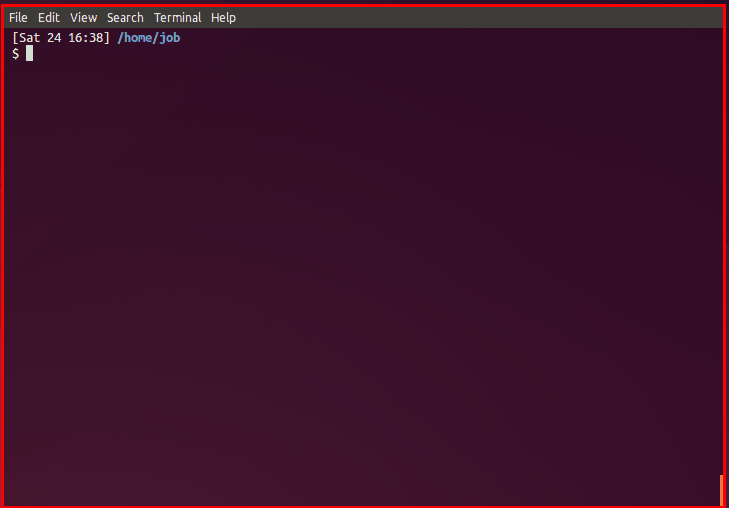

# ◲  desk

[](https://travis-ci.org/jamesob/desk)

Lightweight workspace manager for the shell. 

Desk makes it easy to flip back and forth between different project contexts in
your favorite shell. 

Instead of relying on `CTRL-R` to execute and recall ("that command's gotta
be here somewhere..."), desk helps shorten and document those actions with
shell aliases and functions, which are then namespaced under a particular
desk.

I have a hard time calling this a "workspace manager" with a straight
face -- it's basically just a shell script that sources another shell script in a new shell.
But I often find myself working in multiple different code trees simulataneously:
the quick context switches and namespaced commands that desk facilitates 
have proven useful.

There are no dependencies other than some kind of Unix shell.

```sh
◲  desk 0.1.1

Usage:

    desk
        List the current desk and any associated aliases. If no desk 
        is being used, display available desks.
    desk init
        Initialize desk configuration.
    desk (list|ls)
        List all desks along with a description.
    desk (.|go) desk-name
        Activate a desk.
    desk help
        Show this text.
    desk version
        Show version information.

Since desk spawns a shell, to deactivate and "pop" out a desk, you
simply need to exit or otherwise end the current shell process.
```



For example, given this deskfile
```sh
# tf.sh
# 
# Description: desk for doing work on a terraform-based repository
#

cd ~/terraform-repo

# Set up AWS env variables: <key id> <secret>
set_aws_env() {
  export AWS_ACCESS_KEY_ID="$1"
  export AWS_SECRET_ACCESS_KEY="$2"
}

# Run `terraform plan` with proper AWS var config
plan() {
  terraform plan -module-depth=-1 \
    -var "access_key=${AWS_ACCESS_KEY_ID}" \
    -var "secret_key=${AWS_SECRET_ACCESS_KEY}"
}
 
# Run `terraform apply` with proper AWS var config
alias apply='terraform apply'
```

we'd get 

```sh
$ desk . tf
$ desk

tf
desk for doing work on a terraform repo

  set_aws_env - Set up AWS env variables: <key id> <secret>
  plan - Run `terraform plan` with proper AWS var config
  apply - Run `terraform apply` with proper AWS var config
```
 
Basically, desk just associates a shell script (`name.sh`) with a name. When
you call `desk . name`, desk drops you into a shell where `name.sh` has been
executed, and then desk extracts out certain comments in `name.sh` for useful
rendering.
          
### Installing

0. `git clone <this repo>`
0. `sudo make install` or `cp desk/desk ~/bin/desk`
0. `desk init`

### Deskfile rules

Deskfiles are just shell scripts, nothing more. Desk does pay attention 
to certain kinds of comments, though.

- *description*: you can describe a deskfile by including `# Description: ...`
  somewhere in the file.

- *alias and function docs*: if the line above an alias or function is a 
  comment, it will be used as documentation.

### Sharing deskfiles across computers

Of course, the desk config directory (by default `~/.desks`) can be a symlink
so that deskfiles can be stored in some centralized place, like Dropbox,
and so shared across many computers.
